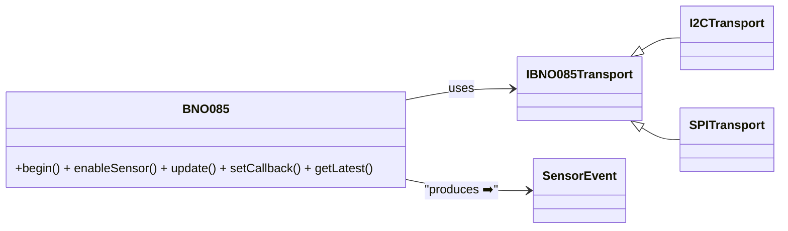

#HF - BNO08x
Hardware Agnostic BNO08x library - as used in the HardFOC-V1 controller

#BNO085 C++ Sensor Library 🚀

> **Full-stack, hardware-agnostic, zero-thread driver for Hillcrest / CEVA BNO08x**  


---

## 📜 Table of Contents
1. [Features ✨](#features-✨)
2. [Architecture 📐](#architecture-📐)
3. [Getting Started 🏁](#getting-started-🏁)
4. [Hardware Wiring 🔌](#hardware-wiring-🔌)
5. [Porting Guide 🧳](#porting-guide-🧳)
   * [ESP32 🚀](#esp32-🚀)
   * [STM32 ⚙️](#stm32-⚙️)
   * [Arduino 🎯](#arduino-🎯)
6. [Usage Examples 💻](#usage-examples-💻)
7. [RVC Mode 🧹](#rvc-mode-🧹)
8. [Firmware Update (DFU) 📦](#firmware-update-dfu-📦)
9. [Advanced Notes 🔬](#advanced-notes-🔬)
10. [Contributing 🤝](#contributing-🤝)
11. [License 📄](#license-📄)
12. [Acknowledgements 🙏](#acknowledgements-🙏)

---

## Features ✨
|   | Capability |
|---|-------------|
| 🎯 **Complete Coverage** | Access every BNO085 SH-2 report: raw & calibrated IMU, rotation vectors, activity, tap/shake, step counter & more. |
| 🛠️ **Hardware-Agnostic** | Abstract transport interface (`IBNO085Transport`) lets you plug in *any* I²C, SPI or UART implementation. |
| 💤 **No Internal Threads** | You control timing – call `update()` in your loop, ISR or RTOS task. |
| 🔁 **Auto Re-Sync** | Detects sensor resets & seamlessly re-enables all configured features. |
| 🧮 **Float-Friendly API** | Returns handy structs (`Vector3`, `Quaternion`, `SensorEvent`) with SI units. |
| 📚 **GPLv3 & Apache-2.0** | C++ wrapper under GPLv3; CEVA SH-2 backend under Apache 2.0 – both included. |
| 🔌 **Pin Control API** | Optional helpers let you drive RSTN/BOOTN/WAKE and switch PS pins to select I²C, UART or SPI. |

---

## Architecture 📐

The BNO085 class shields your app from the gritty SH-2/SHTP details, while IBNO085Transport shields it from your hardware.

## Library Structure 🗂️

```
src/
 ├── BNO085.hpp / BNO085.cpp  - high level driver
 ├── BNO085_Transport.hpp     - transport interface to implement
 ├── sh2/                      - vendor SH-2 library (git submodule)
 ├── app/, rvc/, dfu/          - reference HAL and DFU utilities
```

Only the `BNO085.*` files and your chosen transport implementation are required
for normal use. The other folders provide optional examples and helper code.

## Getting Started 🏁

```bash
#Clone wherever you keep libs 📂
git clone --depth=1 https://github.com/yourOrg/bno085-cpp.git libs/bno085

#Add the.cpp /.h files plus sh2/* to your project build.
# CMake example ⤵️
add_subdirectory(libs/bno085)
target_link_libraries(myApp PRIVATE bno085)
```

Dependencies:
Only a C/C++ compiler (C++11) and your MCU’s I/O driver – no STL, no RTOS.

Hardware Wiring 🔌

```text
MCU 3V3  ──── VIN   BNO085
MCU GND  ──── GND
MCU SCL  ──── SCL   (w/ 4.7 kΩ pull-up)
MCU SDA  ──── SDA   (w/ 4.7 kΩ pull-up)
MCU GPIO ──── INT   (optional, active-low IRQ)
MCU GPIO ──── NRST  (optional reset)
PS0 + PS1 → GND ➡️ selects I²C (tie high for SPI)
ADR/SA0  → GND ➡️ address 0x4A (0x4B if high)
```

Tip: Use the INT line to wake your code only when data is ready – saves power & cycles! ⚡️

Porting Guide 🧳

### ESP32 🚀 (ESP-IDF v5.x)

```cpp
#include "driver/i2c.h"
class Esp32I2CTransport : public IBNO085Transport {
  bool open() override {
      i2c_config_t c = { .mode = I2C_MODE_MASTER,
                         .sda_io_num = 21, .scl_io_num = 22,
                         .master.clk_speed = 400000 };
      i2c_param_config(I2C_NUM_0, &c);
      i2c_driver_install(I2C_NUM_0, c.mode, 0, 0, 0);
      return true;
  }
  int read(uint8_t* d,size_t n)  override {
      return i2c_master_read_from_device(I2C_NUM_0, 0x4A, d, n, 50)==ESP_OK? n:-1; }
  int write(const uint8_t* d,size_t n) override {
      return i2c_master_write_to_device(I2C_NUM_0, 0x4A, d, n, 50)==ESP_OK? n:-1; }
  uint32_t getTimeUs() override { return esp_timer_get_time(); }
};
```

💡 See examples/esp32_idf for a full project, including ISR for the INT pin.

### STM32 ⚙️ (HAL / CubeIDE)

```cpp
extern I2C_HandleTypeDef hi2c1;
class STM32I2CTransport : public IBNO085Transport {
  bool open() override { return HAL_I2C_IsDeviceReady(&hi2c1, 0x4A<<1, 3, 100)==HAL_OK; }
  int  read(uint8_t* b,size_t n) override { return HAL_I2C_Master_Receive(&hi2c1, 0x4A<<1, b,n,100)==HAL_OK?n:-1;}
  int  write(const uint8_t* b,size_t n) override { return HAL_I2C_Master_Transmit(&hi2c1,0x4A<<1,(uint8_t*)b,n,100)==HAL_OK?n:-1;}
  uint32_t getTimeUs() override { return HAL_GetTick()*1000; }
};
```

For SPI: use HAL_SPI_TransmitReceive & toggle CS manually; tie PS0+PS1 high.

### Arduino 🎯

```cpp
#include <Wire.h>
class ArduinoTransport : public IBNO085Transport {
  bool open() override { Wire.begin(); Wire.setClock(400000); delay(50); return true; }
  int  read(uint8_t* b,size_t n) override { Wire.requestFrom(0x4A,n); size_t c=0; while(Wire.available()) b[c++]=Wire.read(); return c;}
  int  write(const uint8_t* b,size_t n) override { Wire.beginTransmission(0x4A); Wire.write(b,n); return Wire.endTransmission()==0?n:-1; }
  uint32_t getTimeUs() override { return micros(); }
};
```

Memory ⛔ note: AVR (<2 KB RAM) is tight – stick to a few low-rate sensors.

Usage Examples 💻

#### Quick Start

```cpp
BNO085 imu(new ArduinoTransport());
if (!imu.begin()) { Serial.println("🚫 IMU not found!"); while(1); }

imu.enableSensor(BNO085Sensor::RotationVector, 10);   // 100 Hz
imu.enableSensor(BNO085Sensor::StepCounter, 0);       // on-change

imu.setCallback([](const SensorEvent& e){
  if (e.sensor == BNO085Sensor::RotationVector) {
      Serial.printf("🧭 Yaw %.1f°\n", e.toEuler().yaw);
  } else if (e.sensor == BNO085Sensor::StepCounter) {
      Serial.printf("👣 Steps: %u\n", e.stepCount);
  }
});

void loop() {
    imu.update();      // call as often as possible (or when INT fires)
}
```

#### Polling Loop

```cpp
while (true) {
    imu.update();                           // pump packets
    if (imu.hasNewData(BNO085Sensor::TapDetector)) {
        auto tap = imu.getLatestData(BNO085Sensor::TapDetector);
        Serial.println(tap.doubleTap ? "👆 Double Tap!" : "👉 Tap!");
    }
    delay(5);
}
```

## RVC Mode 🧹

Some Hillcrest/CEVA sensors offer a simplified "Robot Vacuum Cleaner" (RVC) mode
that streams yaw/pitch/roll and linear acceleration over UART without any SH‑2
commands.  If your application only needs basic orientation data and you want to
avoid the overhead of the full protocol, this mode can be very handy.  The
`src/rvc` folder contains a small decoder library, the `IRvcHal` interface and a
lightweight `Rvc` C++ wrapper to tie everything together.

Entering RVC mode is typically done via boot‑time pin strapping or a vendor
command.  Once enabled the sensor continuously outputs 19‑byte frames at a fixed
baud rate (usually 115200 bps).  Implement `IRvcHal` to read bytes from the
serial port, create a `Rvc` instance with your HAL, and register a callback.
Calling `Rvc::service()` in your main loop will parse incoming frames.
See [`src/rvc/README.md`](src/rvc/README.md) for full details and a complete
example. A minimal program is provided in `examples/RVC_Basic.cpp`.

## Firmware Update (DFU) 📦

The library also provides firmware update helpers in `src/dfu`.  These routines
support both BNO08x IMUs and the FSP200/201 family.  You supply an
`IDfuTransport` implementation to handle the underlying bus (I²C, SPI, UART,…)
and call `dfu()` with the sensor in bootloader mode.  From C++ you can simply
use `BNO085::dfu()` which wraps this helper for the configured transport and
accepts any `HcBin_t` firmware object.  Sample transport adapters and stub
firmware images are included.  The stub files in `src/dfu/firmware-bno.c` and
`src/dfu/firmware-fsp.c` build a default `HcBin_t firmware` object containing
the image which `dfu()` reads from flash.  You may also construct a firmware
object at runtime—for example using the `MemoryFirmware` helper—to stream a
binary stored elsewhere.
To enter the bootloader hold the BOOTN
pin low during reset.  Refer to [`src/dfu/README.md`](src/dfu/README.md) for a
walk‑through of the process.

## Advanced Notes 🔬

- **Tare NOW**: call `imu.tareNow()` to zero the current orientation.
- **Accuracy**: `event.accuracy` (0–3) indicates calibration status. Wait for `3` before trusting the heading.
- **DFU Mode**: hold **BOOTN** low during reset to enter the bootloader for firmware updates.
- **Power Saving**: disable unused reports to save around 20 mA.
- **Pin Helpers**: `hardwareReset()`, `setBootPin()`, `setWakePin()`, `selectInterface()` expose RSTN/BOOTN/WAKE and PS pins when wired.

## Contributing 🤝

Pull requests and issues are welcome!
Please run `clang-format -style=file` before committing and sign off your work (`git commit -s`).

## License 📄

- C++ wrapper code: [GNU GPL v3.0](LICENSE)
- CEVA SH-2 backend: Apache 2.0 (included)

By contributing you agree your code is released under the same GPLv3 license.

## Acknowledgements 🙏

- CEVA Inc. for open-sourcing the SH-2 driver.
- SparkFun & Adafruit for inspiring wiring diagrams.
- Everyone in the open-source IMU community 💖

Made with a cup of ☕ and a dash of 🚀
